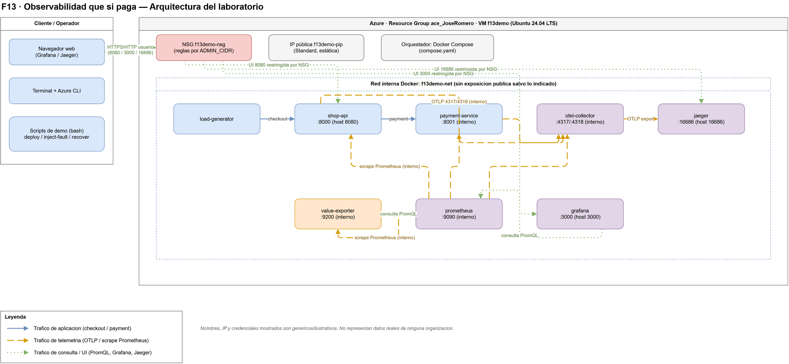

# F13 · Observabilidad que sí paga

Laboratorio reproducible que acompaña la charla **"Observabilidad que sí paga: del
dashboard bonito al impacto en el negocio"**. Despliega, en una única VM de Azure,
un e-commerce de juguete instrumentado con OpenTelemetry y un stack 100% open
source (Prometheus, Jaeger, Grafana) que conecta latencia/errores/disponibilidad
con una estimación financiera en tiempo real.

> ⚠️ **Aviso de valores ilustrativos.** Todos los montos en USD, tasas de
> conversión/abandono y "pérdidas estimadas" que produce este laboratorio son
> **ilustrativos**, pensados para demostrar un método. No representan datos
> reales de ninguna organización, cliente o producto.

## 1. Propósito

Mostrar, con una demo en vivo, cómo pasar de "tengo dashboards" a "puedo
responder cuánto nos cuesta esta degradación ahora mismo": SLIs técnicos y de
negocio, una capa de valor (fórmulas financieras) y una falla inyectada de forma
controlada y reversible en un servicio de pagos.

## 2. Arquitectura



Diagrama editable: [`docs/architecture.drawio`](docs/architecture.drawio) (ábrelo con
[draw.io desktop](https://github.com/jgraph/drawio-desktop) o en
[app.diagrams.net](https://app.diagrams.net)).

## 3. Componentes y flujo de señales

| Servicio | Rol | Puerto | Expuesto a Internet |
|---|---|---|---|
| `load-generator` | Genera tráfico continuo de checkouts | — | No |
| `shop-api` | API de checkout, crea la traza raíz, llama a `payment-service` | 8000 (host `8080`) | Sí (8080) |
| `payment-service` | Procesa el pago, inyecta la falla controlada | 8001 | No |
| `otel-collector` | Recibe OTLP, exporta trazas a Jaeger | 4317/4318 | No |
| `prometheus` | Scrapea métricas técnicas/negocio/Collector | 9090 | No |
| `value-exporter` | Traduce métricas técnicas a métricas financieras | 9200 | No |
| `jaeger` | Backend + UI de trazas distribuidas | 16686 | Sí (16686) |
| `grafana` | Dashboards provisionados automáticamente | 3000 | Sí (3000) |

Flujo resumido: `load-generator → shop-api → payment-service`, ambos exportan
spans OTLP al `otel-collector` (→ `jaeger`) y métricas Prometheus (`prometheus`
scrapea); `value-exporter` consulta Prometheus, calcula la capa de valor y
vuelve a exponerla como métricas; `grafana` consulta Prometheus vía PromQL.
Ver detalle completo en el diagrama de arquitectura.

## 4. Requisitos y permisos mínimos de Azure

Ver [`docs/01-prerequisitos.md`](docs/01-prerequisitos.md). En resumen:
suscripción Azure activa con rol de al menos *Contributor* (o *Virtual Machine
Contributor* + *Network Contributor*) sobre el resource group **existente**
`ace_JoseRomero`, Azure CLI autenticado (`az login`), una clave SSH (ed25519 o
RSA), Git y acceso al repositorio de GitHub. **No** necesitas Docker/Compose en
tu máquina local: se instalan dentro de la VM vía cloud-init.

## 5. Quick start

```bash
# [LOCAL]
git clone https://github.com/Edunzz/f13_demo_observabilidad_que_si_paga.git
cd f13_demo_observabilidad_que_si_paga

export SSH_PUBLIC_KEY_PATH="$HOME/.ssh/f13demo_ed25519.pub"   # o tu clave existente

bash infra/azure/deploy.sh        # crea VM f13demo en ace_JoseRomero
bash scripts/remote-install.sh    # clona el repo en la VM, genera secretos, levanta el stack
bash scripts/smoke-test.sh        # valida health/checkout/dashboards/trazas
bash scripts/demo-start.sh        # confirma estado saludable + imprime URLs

bash scripts/inject-fault.sh      # inyecta latencia + errores en payment-service
bash scripts/recover.sh           # desactiva la falla sin reiniciar el stack
bash scripts/demo-reset.sh        # recover + reinicia acumulador financiero + smoke test
```

## 6. Despliegue paso a paso

1. [`docs/02-despliegue-azure.md`](docs/02-despliegue-azure.md) — `infra/azure/deploy.sh`
   (VNet, NSG, IP pública, VM Ubuntu 24.04, auto-shutdown).
2. [`docs/03-instalacion-demo.md`](docs/03-instalacion-demo.md) — `scripts/remote-install.sh`
   (clona el repo en la VM, genera `.env` con secretos, `docker compose up -d`).
3. Operación diaria: `infra/azure/status.sh`, `start.sh`, `stop.sh`,
   `scripts/show-urls.sh`.

Todos los scripts tienen `-h/--help` y son idempotentes en la medida razonable:
una segunda ejecución de `deploy.sh` no duplica recursos ni destruye datos sin
avisar (ver validaciones de configuración existente en cada script).

## 7. URLs y credenciales

| Servicio | URL |
|---|---|
| Aplicación / landing demo | `http://<IP_PUBLICA>:8080` |
| Grafana | `http://<IP_PUBLICA>:3000` |
| Jaeger | `http://<IP_PUBLICA>:16686` |

`scripts/show-urls.sh` imprime estas URLs con la IP pública vigente. La
contraseña de Grafana (`GF_SECURITY_ADMIN_PASSWORD`) y el token admin de
`payment-service` (`FAULT_ADMIN_TOKEN`) se **generan automáticamente dentro de
la VM** durante `remote-install.sh` y nunca se imprimen en la terminal del
operador ni se commitean. Para consultarlos (solo tú, por SSH):

```bash
# [LOCAL]
ssh azureuser@<IP_PUBLICA> "grep -E 'GF_SECURITY_ADMIN_PASSWORD|FAULT_ADMIN_TOKEN' /opt/f13demo/repo/.env"
```

## 8. Secuencia de demo

Ver [`docs/04-guion-demo-20-min.md`](docs/04-guion-demo-20-min.md) para el guion
minuto a minuto (objetivo → tráfico saludable → dashboard técnico → estado
financiero base → inyección de falla → cascada técnica → impacto financiero →
recuperación → cierre), con comandos exactos, plan B y checklist T-30/T-10/T-2.

## 9. Fórmulas financieras

Ver [`docs/05-modelo-financiero.md`](docs/05-modelo-financiero.md) para el
detalle y un ejemplo numérico completo. Resumen:

```text
ingreso_en_riesgo_usd_min    = error_rate * requests_per_minute * average_request_value_usd
perdida_degradacion_usd_min  = max(degraded_abandonment - baseline_abandonment, 0) * conversions_per_minute * average_ticket_usd
perdida_estimada_total_usd   = integral temporal de las pérdidas por minuto durante la degradación
```

Todas ilustrativas — ver aviso al inicio de este documento.

## 10. SLIs, SLOs y error budget

Ver [`docs/06-sli-slo-error-budget.md`](docs/06-sli-slo-error-budget.md): SLI
técnico (checkouts bajo el umbral de latencia) y SLI de negocio (checkouts
exitosos), SLO ilustrativo 99.9%, error budget restante y burn rate, y la
distinción entre la "ventana acelerada de demostración" usada en vivo y una
ventana real de 30 días (con consulta PromQL de ejemplo para esta última).

## 11. Seguridad

Ver [`docs/07-seguridad.md`](docs/07-seguridad.md). Resumen: NSG restringido a
`ADMIN_CIDR` (IP del operador `/32`), SSH solo con clave pública, Prometheus/OTLP
nunca expuestos a Internet, secretos generados dentro de la VM (nunca en Git),
sin contenedores privilegiados ni montaje de `docker.sock`.

## 12. Troubleshooting

Ver [`docs/08-troubleshooting.md`](docs/08-troubleshooting.md) y
`scripts/collect-diagnostics.sh` para recolectar evidencia diagnosticable.

## 13. Inicio, parada y limpieza (control de costos)

Ver [`docs/09-limpieza-costos.md`](docs/09-limpieza-costos.md). Resumen:

```bash
# [LOCAL]
bash infra/azure/stop.sh                    # az vm deallocate: detiene la facturación de cómputo
bash infra/azure/start.sh                   # vuelve a encender
bash infra/azure/destroy-lab-resources.sh   # borra SOLO los recursos f13demo-*, nunca el resource group
```

## 14. Validación y criterios de éxito

Las pruebas de aceptación del laboratorio (VM correcta, hostname, servicios
healthy, checkout exitoso, métricas `f13_*`, dashboards provisionados, trazas
completas, efecto de la falla en <60s, recuperación, puertos internos no
accesibles desde Internet, CI en verde, diagrama válido, despliegue limpio
siguiendo solo este README) y su evidencia real de ejecución (fecha UTC, commit
SHA, versiones, resultados) se documentan en [`docs/validation.md`](docs/validation.md).

## 15. Licencia y referencias

Este repositorio se publica bajo licencia [MIT](LICENSE).

Referencias oficiales citadas a lo largo de `docs/`:

- Azure CLI (VM, redes, NSG): <https://learn.microsoft.com/azure/virtual-machines/> · <https://learn.microsoft.com/cli/azure/>
- Docker Engine / Compose: <https://docs.docker.com/engine/> · <https://docs.docker.com/compose/>
- OpenTelemetry Collector e instrumentación Python: <https://opentelemetry.io/docs/collector/> · <https://opentelemetry.io/docs/languages/python/>
- Prometheus: <https://prometheus.io/docs/>
- Grafana provisioning y dashboards: <https://grafana.com/docs/grafana/latest/administration/provisioning/>
- Jaeger y OTLP: <https://www.jaegertracing.io/docs/> · <https://opentelemetry.io/docs/specs/otlp/>
- Google SRE (SLI/SLO/error budget/burn rate): <https://sre.google/sre-book/table-of-contents/> · <https://sre.google/workbook/table-of-contents/>
