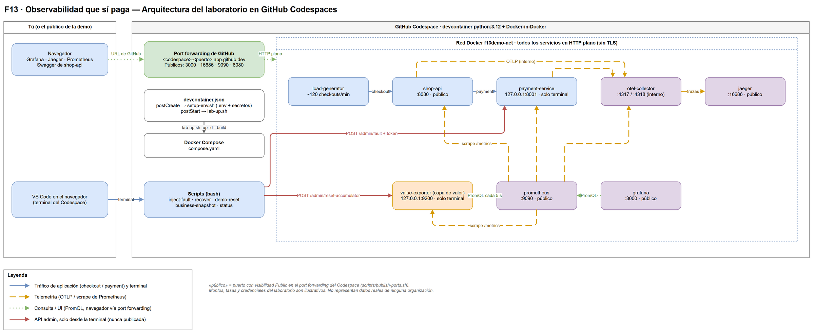

# F13 · Observabilidad que sí paga

[](https://codespaces.new/Edunzz/f13_demo_observabilidad_que_si_paga?quickstart=1)

Laboratorio reproducible que acompaña la charla **"Observabilidad que sí paga: del
dashboard bonito al impacto en el negocio"**. Es un e-commerce de juguete
instrumentado con OpenTelemetry y un stack 100% open source (OpenTelemetry
Collector, Prometheus, Jaeger y Grafana) que convierte latencia, errores y
disponibilidad en **ingreso en riesgo, pérdida por degradación y pérdida estimada**,
en tiempo real.

**Todo se levanta dentro de un GitHub Codespace.** No instalas nada en tu
máquina, no necesitas una nube propia y no hay certificados que configurar: los
servicios corren en HTTP plano. Es una demo.

> ⚠️ **Aviso de valores ilustrativos.** Todos los montos en USD, tasas de
> conversión/abandono y "pérdidas estimadas" que produce este laboratorio son
> **ilustrativos**, pensados para demostrar un método. No representan datos
> reales de ninguna organización, cliente o producto.

## Contenido

1. [Qué vas a ver](#1-qué-vas-a-ver)
2. [Arquitectura](#2-arquitectura)
3. [Arranque en 3 pasos](#3-arranque-en-3-pasos)
4. [Exploración guiada paso a paso](#4-exploración-guiada-paso-a-paso)
5. [Referencia rápida de comandos](#5-referencia-rápida-de-comandos)
6. [Fórmulas financieras](#6-fórmulas-financieras)
7. [SLIs, SLOs y error budget](#7-slis-slos-y-error-budget)
8. [Seguridad (modo demo)](#8-seguridad-modo-demo)
9. [Troubleshooting](#9-troubleshooting)
10. [Costos y limpieza](#10-costos-y-limpieza)
11. [Validación](#11-validación)
12. [Documentación](#12-documentación)
13. [Licencia y referencias](#13-licencia-y-referencias)

## 1. Qué vas a ver

- **Señales**: métricas (qué pasó), trazas (dónde pasó) y logs (por qué pasó),
  todas correlacionadas por `trace_id` gracias a OpenTelemetry.
- **SLIs y SLO**: un SLI técnico (checkouts por debajo de 1 s), un SLI de negocio
  (checkouts exitosos) y un SLO ilustrativo de 99.9% con su error budget.
- **Capa de valor**: un servicio (`value-exporter`) que lee Prometheus y publica
  métricas en dinero: ingreso en riesgo, pérdida por degradación y pérdida
  estimada acumulada.
- **Una falla controlada y reversible** en el servicio de pagos, para ver en
  paralelo la cascada técnica y el tablero expresado en dinero. La pregunta del
  ejercicio: *¿en cuántos segundos lo siente el negocio?*

## 2. Arquitectura



Diagrama editable: [`docs/architecture.drawio`](docs/architecture.drawio) (ábrelo con
[draw.io desktop](https://github.com/jgraph/drawio-desktop) o en
[app.diagrams.net](https://app.diagrams.net)).

| Servicio | Rol | Puerto en el Codespace | ¿Se abre en el navegador? |
|---|---|---|---|
| `load-generator` | Genera ~120 checkouts/min de forma continua | - | No |
| `shop-api` | API de checkout, crea la traza raíz, llama a `payment-service` | `8080` | Sí (Swagger en `/docs`) |
| `payment-service` | Procesa el pago; aquí se inyecta la falla controlada | `127.0.0.1:8001` | No (API admin, solo terminal) |
| `otel-collector` | Recibe OTLP de las apps y exporta trazas a Jaeger | interno (`4317`/`4318`) | No |
| `prometheus` | Scrapea métricas técnicas, de negocio y del Collector | `127.0.0.1:9090` | Sí (PromQL) |
| `value-exporter` | Traduce métricas técnicas a métricas financieras | `127.0.0.1:9200` | No (solo terminal) |
| `jaeger` | Backend + UI de trazas distribuidas | `16686` | Sí |
| `grafana` | Dashboards provisionados automáticamente | `3000` | Sí |

Flujo: `load-generator → shop-api → payment-service`. Ambas apps exportan spans
OTLP al `otel-collector` (→ `jaeger`) y exponen `/metrics` (→ `prometheus`).
`value-exporter` consulta Prometheus, calcula la capa de valor y la vuelve a
exponer como métricas; `grafana` lee Prometheus (y Jaeger) para los dashboards.

Cómo se arma el entorno del Codespace (devcontainer, Docker-in-Docker, puertos,
`.env`): [`docs/02-codespaces.md`](docs/02-codespaces.md).

## 3. Arranque en 3 pasos

1. **Crea el Codespace.** Haz clic en el botón **Abrir en GitHub Codespaces** de
   arriba, o en GitHub: **Code → Codespaces → Create codespace on main**. La
   máquina por defecto (2 núcleos, 8 GB) es suficiente.
2. **Espera a que termine el arranque automático** (3-5 minutos la primera vez).
   El devcontainer ejecuta solo:
   - `postCreateCommand` → [`scripts/setup-env.sh`](scripts/setup-env.sh): crea `.env`
     y genera los secretos (contraseña de Grafana y token admin de la falla).
   - `postStartCommand` → [`scripts/lab-up.sh`](scripts/lab-up.sh): construye las
     imágenes, levanta el stack con Docker Compose, espera los healthchecks,
     corre el smoke test, **publica los puertos web** e imprime las URLs.

   Termina con `Laboratorio F13 listo.` y la tabla de URLs. Si cerraste esa
   terminal, consulta el estado cuando quieras con:

   ```bash
   bash scripts/status.sh
   ```

3. **Abre Grafana.** En la pestaña **PORTS** de VS Code, abre el puerto `3000`
   (*Grafana (dashboards)*), o usa la URL que imprime `bash scripts/show-urls.sh`.
   Grafana abre sin login (acceso anónimo con rol Editor).

> **HTTP plano, sin TLS.** Todos los servicios hablan HTTP; no hay certificados
> en el laboratorio. La URL que ves en el navegador
> (`<codespace>-<puerto>.app.github.dev`) es el proxy de port forwarding de GitHub,
> que GitHub sirve siempre con su propio `https` en el borde: no hay nada que
> configurar. `lab-up.sh` deja los puertos web en visibilidad **Public** para que
> puedas compartirlos durante la demo; vuelve a privados con
> `bash scripts/publish-ports.sh --private`.

¿Algo no levantó? Vuelve a correr `bash scripts/lab-up.sh` (es idempotente) y revisa
[Troubleshooting](#9-troubleshooting).

## 4. Exploración guiada paso a paso

Recorrido de ~40 minutos. Todos los comandos se ejecutan en la **terminal del
Codespace** (menú ☰ → Terminal → New Terminal), desde la raíz del repo. Abre una
segunda terminal con el botón *Split* cuando un paso lo pida.

### Paso 0 - Orientación

```bash
bash scripts/status.sh          # contenedores, estado de la falla y URLs
docker compose ps               # los 8 servicios del laboratorio
```

Qué observar: todos los contenedores en `running`/`healthy` (salvo
`load-generator` y `otel-collector`, que no tienen healthcheck por diseño) y la
falla con `"active": false`.

### Paso 1 - La aplicación: una compra de punta a punta

Haz una compra a mano:

```bash
curl -s -X POST localhost:8080/checkout \
  -H 'Content-Type: application/json' \
  -d '{"amount_usd": 75}'
```

Respuesta esperada (aproximada):

```json
{"order_id":"3f9c1a2b","outcome":"success","amount_usd":75.0,"duration_ms":12.4}
```

También puedes hacerla desde el navegador: puerto `8080` → `/docs` (Swagger UI) →
`POST /checkout` → *Try it out*.

Mientras tanto, `load-generator` envía ~120 checkouts por minuto. Míralo trabajar
(sal con `Ctrl+C`):

```bash
docker compose logs -f --tail=5 load-generator
```

### Paso 2 - Métricas: *qué pasó*

Las apps exponen métricas Prometheus con prefijo `f13_`:

```bash
curl -s localhost:8080/metrics | grep '^f13_'
```

Abre **Prometheus** (puerto `9090`) → pestaña *Query* y ejecuta:

| Pregunta | PromQL |
|---|---|
| Checkouts por minuto, por resultado | `sum by (outcome) (rate(f13_checkout_requests_total[1m])) * 60` |
| Latencia p95 del checkout | `histogram_quantile(0.95, sum by (le) (rate(f13_checkout_duration_seconds_bucket[5m])))` |
| Tasa de éxito (SLI de negocio, ya precalculada) | `f13:checkout_success_rate_5m` |

En **Status → Rule health** (o `/rules`) verás las *recording rules* `f13:*` de
[`observability/prometheus/rules.yml`](observability/prometheus/rules.yml) y la
alerta ilustrativa de burn rate.

Por qué importa: una métrica responde *qué* y *cuánto*, pero todavía no *dónde*
ni *por qué*.

### Paso 3 - Trazas: *dónde pasó*

Abre **Jaeger** (puerto `16686`):

1. En **Service** elige `shop-api` → **Find Traces**.
2. Abre una traza: verás el span `checkout` de `shop-api` y, dentro, la llamada
   HTTP y el span `payment` de `payment-service`, enlazados por W3C Trace Context.
3. Abre un span y revisa sus *tags* de negocio: `business.operation`,
   `business.payment.outcome`, `business.currency` y `fault.injected`.

Por qué importa: la traza muestra el camino exacto de una compra y en qué servicio
se fue el tiempo.

### Paso 4 - Logs: *por qué pasó* (y cómo se correlacionan)

Cada log de las apps es JSON e incluye el `trace_id` del span activo:

```bash
docker compose logs --no-log-prefix --tail=50 shop-api | grep checkout_processed | tail -n 1
```

Salida esperada (aproximada):

```json
{"timestamp": "...", "level": "INFO", "service": "shop-api", "event": "checkout_processed", "trace_id": "4bf92f3577b34da6a3ce929d0e0e4736", "span_id": "...", "order_id": "...", "duration_ms": 11.8, "outcome": "success", "fault_active": false}
```

Copia el `trace_id` y pégalo en la caja de búsqueda superior de Jaeger
(*Lookup by Trace ID*): llegas a la traza exacta de ese log. Lo mismo funciona en
Grafana → **Explore** → datasource **Jaeger**.

Por qué importa: métricas, trazas y logs son el insumo; la correlación por
`trace_id` es lo que permite saltar del síntoma a la causa en segundos.

### Paso 5 - SLIs, SLO y error budget

En Grafana abre **Dashboards → F13 → "F13 | Salud tecnica"** y recorre las filas
*Checkout*, *Pagos* y *SLIs, SLO y error budget*:

- **"SLI tecnico (checkouts < 1s / total, 5m)"**: lo que percibe el usuario en latencia.
- **"SLI de negocio (checkouts exitosos / total, 5m)"**: el que se traduce a dinero.
- **"Error budget restante"** y **"SLO objetivo / burn rate instantaneo"**: contra
  un SLO ilustrativo de 99.9%.

Con el sistema sano, el error budget está prácticamente completo.

> Ventana acelerada: el laboratorio usa ventanas de 1-5 minutos para que el efecto
> se vea durante la demo; en producción un SLO se mide en ventanas de ~30 días.
> Detalle y PromQL equivalente en [`docs/06-sli-slo-error-budget.md`](docs/06-sli-slo-error-budget.md).

### Paso 6 - La capa de valor: de señales a dinero

`value-exporter` lee Prometheus cada 5 s, aplica las fórmulas y publica el
resultado como métricas nuevas:

```bash
curl -s localhost:9200/metrics | grep '^f13_'
bash scripts/business-snapshot.sh
```

`business-snapshot.sh` resume en la terminal las señales técnicas, el SLO y la capa
de valor:

```text
== F13 · snapshot técnico + negocio (2026-10-06 18:40:12 UTC) ==
Señales técnicas
  Falla inyectada activa                               NO
  Checkouts por minuto                              118.2
  Tasa de error de checkout (1m)                   0.00 %
  Latencia p95 de checkout (1m)                   0.048 s
SLO (ventana acelerada de demo)
  SLO objetivo                                    99.90 %
  Error budget restante                          100.00 %
Capa de valor (valores ILUSTRATIVOS)
  Ingreso en riesgo                          0.00 USD/min
  Pérdida por degradación                    0.00 USD/min
  Pérdida estimada acumulada                     0.00 USD
```

Abre también **"F13 | Impacto en el negocio"** en Grafana. Esa es la línea base:
ingreso en riesgo en (o muy cerca de) cero. Las fórmulas están en la
[sección 6](#6-fórmulas-financieras).

### Paso 7 - Rompe algo, de forma controlada

Prepara la vista:

- Navegador: **"F13 | Impacto en el negocio"** y, en otra pestaña, **"F13 | Salud tecnica"**.
- Terminal 1: refresco continuo del snapshot.

  ```bash
  watch -n 5 bash scripts/business-snapshot.sh
  ```

- Terminal 2 (*Split*): inyecta 1.8 s de latencia y 30% de errores en `payment-service`.

  ```bash
  bash scripts/inject-fault.sh --yes
  ```

  Salida esperada (aproximada):

  ```text
  Estado ANTERIOR: {"active":false,"latency_ms":1800,"error_rate":0.3}
  Estado NUEVO: {"active":true,"latency_ms":1800,"error_rate":0.3}
  [INFO ] Falla activa confirmada (f13_fault_active=1).
  ```

Qué observar en los siguientes 30-60 segundos:

| Señal | Antes | Durante la falla (aprox.) |
|---|---|---|
| Falla inyectada activa | NO | SI |
| Latencia p95 de checkout | < 0.05 s | ~1.9-2 s (cae en el bucket 1.5-2 s del histograma) |
| Tasa de error de checkout | ~0% | ~30% |
| Ingreso en riesgo | ~0 USD/min | cientos de USD/min |
| Pérdida por degradación | 0 USD/min | > 0 USD/min |
| Pérdida estimada acumulada | 0 USD | crece cada 5 s |
| Error budget restante | ~100% | 0% |

> ¿Por qué no ves los 1 800 USD/min del ejemplo de `docs/05`? Porque
> `load-generator` es un único cliente secuencial: con 1.8 s extra por compra,
> envía menos checkouts por minuto, y la capa de valor usa el tráfico **observado**.
> Es una buena conversación para la charla: la latencia también se come el
> tráfico. Detalle en [`docs/05-modelo-financiero.md`](docs/05-modelo-financiero.md).

### Paso 8 - Sigue la cascada en trazas y logs

- **Jaeger**: Service `payment-service`, Tags `business.payment.outcome=error` →
  **Find Traces**. Verás spans de ~1.8 s y el resultado de error; prueba también
  `fault.injected=true`.
- **Logs** de los pagos fallidos:

  ```bash
  docker compose logs --no-log-prefix --tail=100 payment-service | grep '"outcome": "error"' | tail -n 3
  ```

- **"F13 | Salud tecnica"**: el panel **"Estado de la falla inyectada (f13_fault_active)"**
  pasa a 1 y **"Throughput y errores de payment-service"** muestra el pico de errores.
- **"F13 | Impacto en el negocio"** → **"Overlay: latencia p95, tasa de error e
  ingreso en riesgo"**: las tres curvas suben juntas. Esa es la correlación
  técnica ↔ financiera.

### Paso 9 - Recupera sin reiniciar nada

```bash
bash scripts/recover.sh
```

La falla se apaga en caliente (`f13_fault_active=0`) y, en 1-5 minutos (lo que
tardan en vaciarse las ventanas móviles), latencia, errores e ingreso en riesgo
vuelven a la línea base. La **pérdida estimada acumulada se queda**: es el costo
total del incidente. Para dejar todo en cero y repetir:

```bash
bash scripts/demo-reset.sh      # recover + reset del acumulador + smoke test
```

### Paso 10 - Haz tuyo el modelo

- **Cambia los supuestos de negocio** en `.env` (por ejemplo
  `AVERAGE_REQUEST_VALUE_USD=120`, `DEGRADED_ABANDONMENT_RATE=0.50` o
  `SLO_TARGET_RATIO=0.99`) y aplica:

  ```bash
  docker compose up -d          # recrea solo los servicios cuya configuración cambió
  ```

- **Prueba otra falla**: solo latencia y pocos errores, o una caída fuerte.

  ```bash
  bash scripts/inject-fault.sh 600 0.05 --yes    # degradación leve
  bash scripts/inject-fault.sh 3000 0.6 --yes    # incidente serio
  bash scripts/recover.sh
  ```

- **Lee y prueba las fórmulas**: están en
  [`app/value-exporter/src/formulas.py`](app/value-exporter/src/formulas.py), con
  pruebas unitarias. Corre todas las pruebas de las apps con:

  ```bash
  make test
  ```

### Paso 11 - Apaga

```bash
docker compose down             # detiene el stack (conserva métricas y trazas)
```

Luego detén o borra el Codespace (ver [Costos y limpieza](#10-costos-y-limpieza)).

## 5. Referencia rápida de comandos

Todos los scripts tienen `-h/--help`. `make help` lista los atajos.

| Script | Atajo `make` | Qué hace |
|---|---|---|
| `bash scripts/lab-up.sh` | `make up` | Prepara `.env`, construye, levanta, espera healthchecks, smoke test, publica puertos e imprime URLs |
| `bash scripts/status.sh` | `make status` | Contenedores, estado de la falla y URLs (solo lectura) |
| `bash scripts/show-urls.sh` | `make urls` | URLs del laboratorio (Codespaces o `localhost`) |
| `bash scripts/smoke-test.sh` | `make smoke-test` | Health, checkout, métricas `f13_*`, dashboards y trazas |
| `bash scripts/business-snapshot.sh` | `make snapshot` | Señales técnicas, SLO y capa de valor en la terminal |
| `bash scripts/inject-fault.sh [ms] [rate] [--yes]` | `make fault` | Inyecta latencia + errores en `payment-service` |
| `bash scripts/recover.sh` | `make recover` | Desactiva la falla sin reiniciar el stack |
| `bash scripts/demo-reset.sh` | `make reset` | Recover + reset del acumulador financiero + smoke test |
| `bash scripts/publish-ports.sh [--private]` | - | Puertos web en visibilidad Public (o Private) |
| `bash scripts/setup-env.sh` | - | Crea/completa `.env` y genera secretos (idempotente) |
| `bash scripts/collect-diagnostics.sh` | `make diagnostics` | Empaqueta ps, logs y config sanitizada en `diagnostics/` |
| - | `make down` / `make clean` | Detiene el stack / lo detiene y borra sus volúmenes |

Guion minuto a minuto para presentarlo en vivo (20 min), con plan B y checklist:
[`docs/04-guion-demo-20-min.md`](docs/04-guion-demo-20-min.md).

## 6. Fórmulas financieras

Detalle y ejemplo numérico completo en
[`docs/05-modelo-financiero.md`](docs/05-modelo-financiero.md). Resumen:

```text
ingreso_en_riesgo_usd_min    = error_rate * requests_per_minute * average_request_value_usd
perdida_degradacion_usd_min  = max(degraded_abandonment - baseline_abandonment, 0) * conversions_per_minute * average_ticket_usd
perdida_estimada_total_usd   = integral temporal de las pérdidas por minuto durante la degradación
```

Todas ilustrativas: ver aviso al inicio de este documento.

## 7. SLIs, SLOs y error budget

Ver [`docs/06-sli-slo-error-budget.md`](docs/06-sli-slo-error-budget.md): SLI técnico
(checkouts bajo el umbral de latencia) y SLI de negocio (checkouts exitosos), SLO
ilustrativo 99.9%, error budget restante y burn rate, y la diferencia entre la
"ventana acelerada de demostración" usada en vivo y una ventana real de 30 días.

## 8. Seguridad (modo demo)

Ver [`docs/07-seguridad.md`](docs/07-seguridad.md). Resumen:

- Todo corre en **HTTP plano** dentro del Codespace; no hay TLS ni certificados.
- `lab-up.sh` publica **solo** los puertos web (Grafana, Jaeger, Prometheus y
  `shop-api`). Las APIs administrativas (`payment-service:8001` y
  `value-exporter:9200`) escuchan solo en `127.0.0.1` y nunca se publican: la falla
  solo se inyecta desde la terminal del Codespace y exige un token.
- Los secretos se generan dentro del Codespace en `.env` (ignorado por Git) y
  nunca se imprimen.
- Grafana tiene acceso anónimo con rol Editor para explorar sin login. Si no
  quieres puertos públicos: `bash scripts/publish-ports.sh --private`.

## 9. Troubleshooting

Ver [`docs/08-troubleshooting.md`](docs/08-troubleshooting.md). Los tres más comunes:

| Síntoma | Qué hacer |
|---|---|
| El Codespace abrió pero no hay URLs | `bash scripts/status.sh`; si no hay contenedores, `bash scripts/lab-up.sh` |
| Grafana muestra "No data" recién arrancado | Espera 1-2 ciclos de scrape (5 s); si persiste, `docker compose logs --tail=50 value-exporter` |
| La URL pide login de GitHub | El puerto quedó privado: `bash scripts/publish-ports.sh` (o pestaña PORTS → Port Visibility → Public) |

Para reportar un problema: `bash scripts/collect-diagnostics.sh` y adjunta el
`.tar.gz` de `diagnostics/`.

## 10. Costos y limpieza

Ver [`docs/09-limpieza-costos.md`](docs/09-limpieza-costos.md). Un Codespace consume
horas de cómputo y almacenamiento de tu cuota de GitHub mientras existe:

- **Detenerlo** (Codespaces → *Stop codespace*, o se detiene solo tras el tiempo de
  inactividad): deja de consumir cómputo; al volver a abrirlo, `lab-up.sh` levanta
  el stack de nuevo.
- **Borrarlo** cuando termines: libera también el almacenamiento.

## 11. Validación

Cada push a `main` ejecuta [`.github/workflows/validate.yml`](.github/workflows/validate.yml):
ShellCheck, YAML lint, pruebas unitarias de las 4 apps, JSON de dashboards y del
devcontainer, diagrama Draw.io, gitleaks, el **ciclo completo de la demo** en el
runner (`lab-up.sh` → falla → ingreso en riesgo > 0 → recuperación → reset) y la
construcción del **devcontainer de Codespaces** con el laboratorio levantado
dentro. Evidencia y criterios de aceptación en [`docs/validation.md`](docs/validation.md).

## 12. Documentación

| Documento | Contenido |
|---|---|
| [`docs/01-prerequisitos.md`](docs/01-prerequisitos.md) | Qué necesitas (spoiler: una cuenta de GitHub) |
| [`docs/02-codespaces.md`](docs/02-codespaces.md) | Cómo está armado el Codespace: devcontainer, ciclo de vida, puertos, `.env` |
| [`docs/03-operacion-scripts.md`](docs/03-operacion-scripts.md) | Referencia de cada script, variables de `.env` y credenciales |
| [`docs/04-guion-demo-20-min.md`](docs/04-guion-demo-20-min.md) | Guion de la demo en vivo, plan B y checklist |
| [`docs/05-modelo-financiero.md`](docs/05-modelo-financiero.md) | Capa de valor: fórmulas, ejemplo numérico y limitaciones |
| [`docs/06-sli-slo-error-budget.md`](docs/06-sli-slo-error-budget.md) | SLIs, SLO, error budget y burn rate |
| [`docs/07-seguridad.md`](docs/07-seguridad.md) | Modelo de seguridad del modo demo |
| [`docs/08-troubleshooting.md`](docs/08-troubleshooting.md) | Problemas comunes y diagnóstico |
| [`docs/09-limpieza-costos.md`](docs/09-limpieza-costos.md) | Cuota de Codespaces, detener y borrar |
| [`docs/validation.md`](docs/validation.md) | Criterios de aceptación y evidencia de CI |
| [`VERSIONS.md`](VERSIONS.md) | Versiones fijadas de imágenes y dependencias |

## 13. Licencia y referencias

Este repositorio se publica bajo licencia [MIT](LICENSE).

- GitHub Codespaces y dev containers: <https://docs.github.com/codespaces> · <https://containers.dev/>
- Docker Compose: <https://docs.docker.com/compose/>
- OpenTelemetry Collector e instrumentación Python: <https://opentelemetry.io/docs/collector/> · <https://opentelemetry.io/docs/languages/python/>
- Prometheus: <https://prometheus.io/docs/>
- Grafana provisioning y dashboards: <https://grafana.com/docs/grafana/latest/administration/provisioning/>
- Jaeger y OTLP: <https://www.jaegertracing.io/docs/> · <https://opentelemetry.io/docs/specs/otlp/>
- Google SRE (SLI/SLO/error budget/burn rate): <https://sre.google/sre-book/table-of-contents/> · <https://sre.google/workbook/table-of-contents/>
